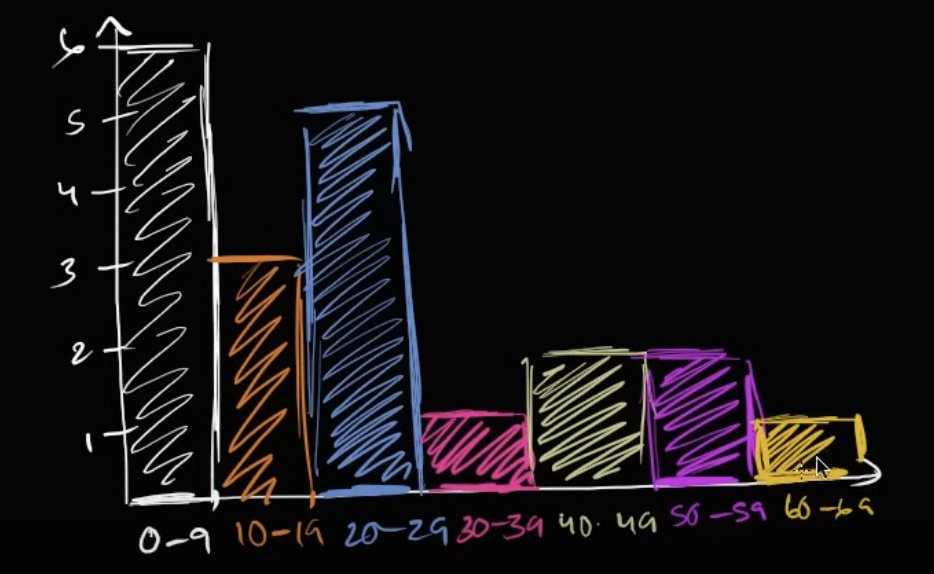

## 히스토리그램 (histogram)

레스토랑에 방문한 연령대를 나타내기

연령:
1, 3, 27, 32, 5, 63, 26, 25, 18, 16,
4, 45, 29, 19, 22, 51, 58, 7, 42, 6

| Bucket  | #   | Bar    |
|---------|-----|--------|
| 0 ~ 9   | 6   | ██████ |
| 10 ~ 19 | 3   | ███    |
| 20 ~ 29 | 5   | █████  |
| 30 ~ 39 | 1   | █      |
| 40 ~ 49 | 2   | ██     |
| 50 ~ 59 | 2   | ██     |
| 60 ~ 69 | 1   | █      |

