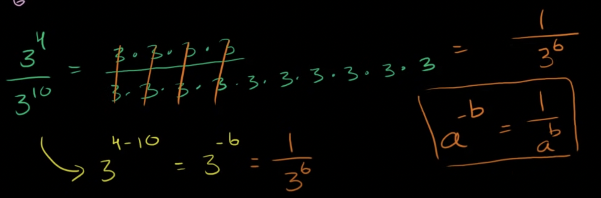

## 나눗셈에서의 지수법칙

### (5 ** 6) / (5 ** 2)

`(5 ** 6) / (5 ** 2) === (5 * 5 * 5 * 5 * 5 * 5) / (5 * 5)`

`(5 * 5 * 5 * 5 * 5 * 5) / (5 * 5) === 5 * 5 * 5 * 5`

`5 * 5 * 5 * 5 === 5 ** 4`

`5 ** (6 - 2)`

### 3 ** 4 / 3 ** 10

`3 ** (4 - 10) === 3 ** -6`

### 지수가 음수 일 때 

`3 ** -6` 은 `1 / 3 ** 6` 과 같다.

```js
3 ** -6 // 0.0013717421124828...
1 / 3 ** 6 // 0.0013717421124828...
```


